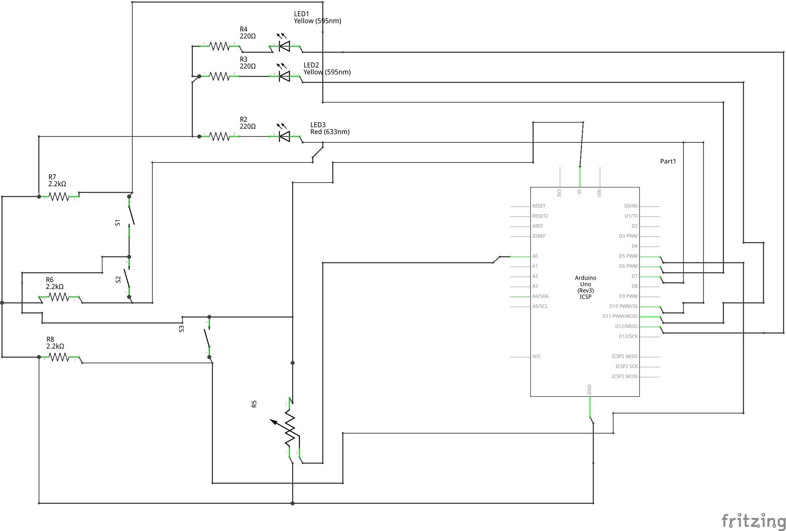
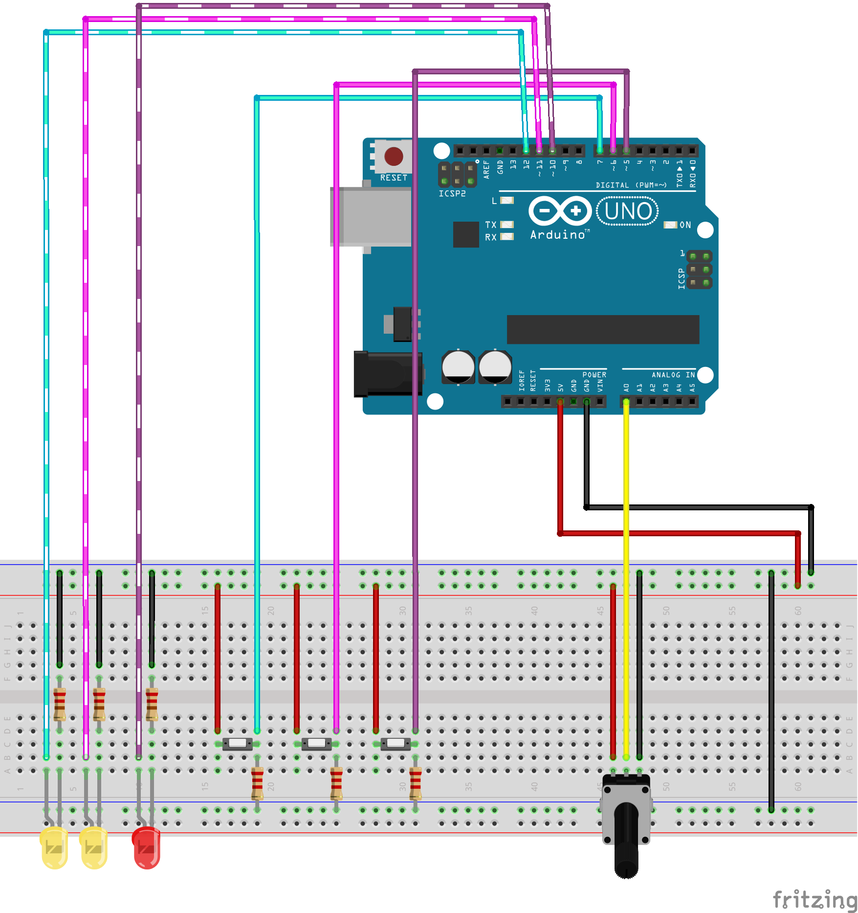

# Habitacle-Target-Link

Simple *Target Link* implementation for *Arduino*.

## Getting started

### Hardware

Required hardware:

* Arduino with at least (6 digital I/O : 3 inputs, 3 outpus and 1 analog input)
* 3 ~1 kOhm resistors (pull up for buttons)
* 3 ~220 Ohm resistors (leds)
* 3 leds
* 3 push buttons
* 1 rotatory shaft potentiometer
* 1 breadboard

Circuit schematic is the following:



Make this:



### Software

Clone this :

```bash
git clone https://github.com/raymas/Habitacle-Target-Link.git
```

Compile and Upload with *Arduino IDE*

## Contributing

Report errors here!
